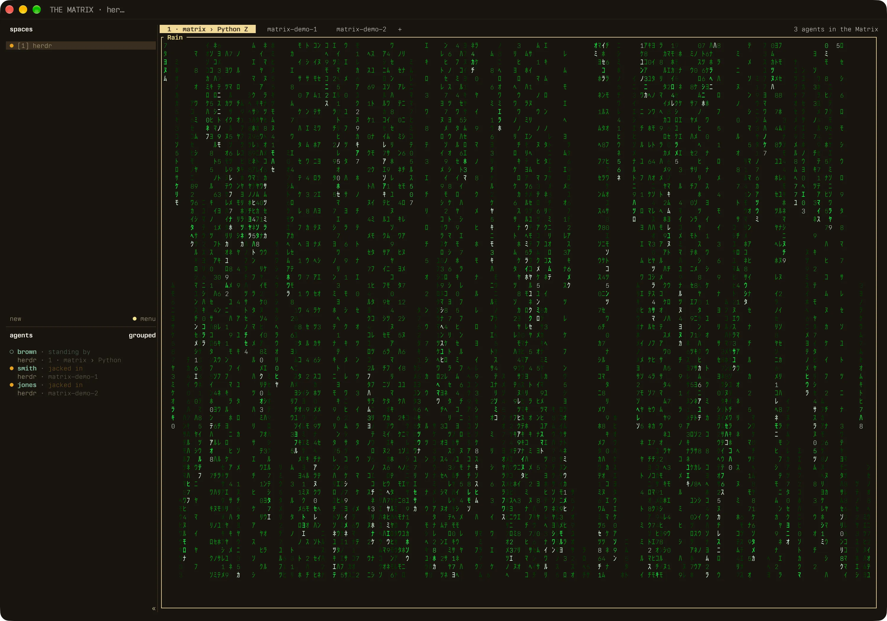

# herdr-matrix



A Herdr plugin that renames agents after the Agents in The Matrix, gives them Matrix status wording, numbers the spaces in the sidebar, and runs digital rain when everything is quiet.

## What it does

- Renames each new agent: smith, brown, jones, johnson, jackson, thompson, gray. Then generic surnames (williams, white, adams and so on), then `smith-2`, `smith-3`. Agents you already named keep their names, and a name is free again when its agent closes. Herdr only accepts lowercase names.
- Sets status labels: working is "jacked in", idle is "standing by", blocked is "awaiting operator", done is "exited". Show them with the `state_text` sidebar token.
- Opens a rain overlay after every agent has been "standing by" for 10 minutes. Any key dismisses it, and any status change resets the countdown. It never opens a second overlay.
- Shows a toast, "Agent smith has been deleted.", when an agent's pane goes away. If several close together, one toast lists them all. Toasts need `delivery = "herdr"` in the config below, or Herdr drops them.
- Boss mode. `madebygrant.herdr-matrix.mark-space` marks or unmarks the focused space. `madebygrant.herdr-matrix.boss-mode` then hides every agent in the marked spaces and swaps each marked space's sidebar name for a cover name: space-alpha, space-beta and so on, in the order the spaces were marked. Each tab in a marked space is covered with digital rain that ignores keys. Run it again to bring everything back. Marks survive boss mode turning off, and a closed space drops its mark. Boss mode shows no toast, and it comes back on after a server restart if it was on before.
- Opens the focused space in Zed. `madebygrant.herdr-matrix.open-in-zed` runs `zed -e <dir>` for the focused space, using the working directory of a pane in its active tab. `-e` opens it in an existing Zed window rather than a new one. It needs `zed` on your `PATH`.
- Numbers the spaces in the sidebar: the `numbered` token reads "[1] name", `kanji` reads "一 name" and `wsnum` reads "[1]". They follow moves, closes and renames. They also follow `cd`, but only when a plugin such as auto-title renames the tab, because Herdr emits no event when it relabels a space after a `cd`. Boss mode covers the name in `numbered` and `kanji` too. Swap `$numbered` for `$kanji` in the sidebar row below to show kanji numerals.
- Prints "N agents in the Matrix" for the tab bar with `tab_bar.py`. Agents boss mode hides are left out of the count.

## Install

```sh
herdr plugin install madebygrant/herdr-matrix
```

It needs Herdr 0.8.2 or newer and `python3`.

## Config

The plugin covers names, labels, rain and the toast text. The window title, tab bar, sidebar rows, keys and toast delivery live in `~/.config/herdr/config.toml`:

```toml
[ui]
window_title = "THE MATRIX · {workspace}"
tab_bar_right = [
  { type = "command", command = "python3 -I /path/to/herdr-matrix/tab_bar.py" },
]

[ui.toast]
delivery = "herdr"

[ui.toast.herdr]
position = "top-right"

[ui.sidebar.agents]
rows = [["state_icon", { token = "agent", fg = "#86BC9E", bold = true, dim = false }, { token = "state_text", dim = true }], [{ token = "workspace", bold = false }, "tab"]]

[ui.sidebar.spaces]
rows = [["state_icon", "$numbered"], ["branch", "git_status"]]

[[keys.command]]
key = "prefix+b"
type = "plugin_action"
command = "madebygrant.herdr-matrix.mark-space"
description = "matrix: mark space for boss mode"

[[keys.command]]
key = "prefix+shift+b"
type = "plugin_action"
command = "madebygrant.herdr-matrix.boss-mode"
description = "matrix: toggle boss mode"

[[keys.command]]
key = "prefix+z"
type = "plugin_action"
command = "madebygrant.herdr-matrix.open-in-zed"
description = "matrix: open space in Zed"
```

Set the `tab_bar.py` path to where the plugin lives, then run `herdr server reload-config`.

## Tuning

All three are constants at the top of `matrix.py`: `IDLE_SECONDS` (600), `CANON` and `SURNAMES` for name order, and `LABELS` for status wording.

## Trying it

```sh
herdr plugin pane open --plugin madebygrant.herdr-matrix --entrypoint rain --placement overlay --focus
herdr plugin log list --plugin madebygrant.herdr-matrix
```

The first command opens the rain now. The second shows recent hook runs and their errors. State (remembered names, idle counter, waiter pid) is in `~/.local/state/herdr/plugins/madebygrant.herdr-matrix/`.

## Limits

- The rain overlay takes focus, so a key you press as it opens is lost.
- The plugin only names agents when Herdr detects them. To name one that was already running, run the detect hook by hand from the plugin directory:

  ```sh
  HERDR_PLUGIN_STATE_DIR=~/.local/state/herdr/plugins/madebygrant.herdr-matrix \
  HERDR_PLUGIN_EVENT=pane.agent_detected HERDR_PANE_ID=<pane> python3 -I matrix.py
  ```

- The kill message needs the plugin to have recorded the agent's name first, so agents that predate the plugin get none until a status event fires.
- Herdr shows one toast at a time. A second one returns `busy`, so the plugin retries the kill message up to four times, three seconds apart, and may still drop it.
- Herdr decides how often the tab bar command runs.
- Herdr can't remove a space's sidebar row, so boss mode disguises it. The cover replaces the `workspace`, `numbered` and `kanji` tokens. A row built from other tokens, and a window title using `{workspace}`, still show the real name.
- Kanji numerals go up to 九十九 (99). Spaces from 100 on show Arabic digits in the `kanji` token.
- Herdr can only put a pane in another space by zooming it over an existing pane, and it focuses that space even when asked not to. Turning boss mode on therefore jumps through each marked space and back. A tab opened in a marked space while boss mode is on gets no rain, and unzooming a tab shows what's under the rain.

## Upgrading from 0.2

Boss mode replaces the `toggle-hide` and `show-all` actions. Delete their `[[keys.command]]` bindings. `herdr config check` doesn't flag them, and pressing one only gets `plugin_action_not_found`. The first plugin hook after you reinstall shows any agents you had hidden.

## Releasing

```sh
scripts/release.sh patch   # or minor, major
scripts/release.sh current # tag the version already in herdr-plugin.toml
```

Add `--dry-run` to print the steps without running them. The script needs a clean `main` that matches `origin/main`. It bumps `version` in `herdr-plugin.toml`, commits it, tags `vX.Y.Z`, pushes both, and creates a GitHub release with generated notes if `gh` is installed. Users can pin a release with `herdr plugin install --ref vX.Y.Z madebygrant/herdr-matrix`.

## License

MIT. See `LICENSE`.
